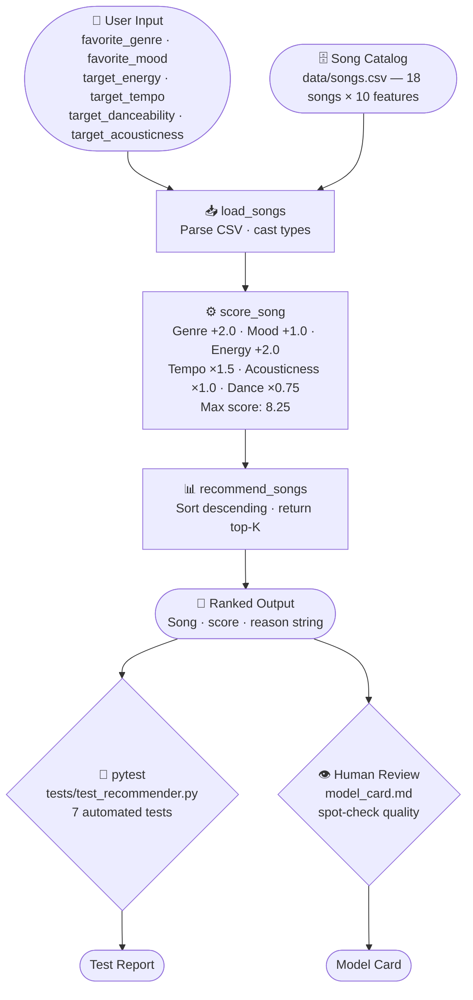

# BestMatchMusic — Music Recommender Simulation

## Title and Summary

**BestMatchMusic** is a rule-based music recommendation engine that scores a catalog of songs against a user's taste profile and returns the top matches ranked by fit. It demonstrates how real recommender systems work under the hood — turning structured data and weighted scoring rules into personalized output — without relying on a pre-trained ML model.

This project matters because most people interact with recommendation systems every day (Spotify, YouTube, Netflix) without understanding how they work. Building one from scratch makes those systems legible and shows where human judgment, bias, and design decisions shape what you see.

---

## Original Project

This project is **Module 3** of the AI110 course series. It builds directly on the data modeling and OOP patterns introduced in **Module 2 (PawPal)**, which was a pet profile and care suggestion tool. PawPal used structured data classes and simple matching logic to suggest care routines for pets based on breed and age. BestMatchMusic applies the same idea — user profile + catalog scoring — but extends it with a multi-feature weighted algorithm, numeric proximity functions, and a formal model card evaluation.

---

## Architecture Overview

The system has four main stages:

1. **Load** — `load_songs()` reads `data/songs.csv` and casts every row into typed Python dicts (strings become floats/ints).
2. **Score** — `score_song()` runs each song through a 6-factor weighted rubric against the user's preferences and returns a total score plus a list of reasons.
3. **Rank** — `recommend_songs()` collects all scores, sorts them highest to lowest, and returns the top K.
4. **Output** — `main.py` prints the ranked results with scores and explanations to the terminal.

An OOP wrapper (`Recommender` class) exposes the same logic for the automated test suite.

Full component map: [diagrams/system_diagram.md](diagrams/system_diagram.md)




---

## Setup Instructions

**Requirements:** Python 3.9+

1. Clone the repository:
   ```bash
   git clone https://github.com/Timilton/ai110-module3show-musicrecommendersimulation-starter.git
   cd ai110-module3show-musicrecommendersimulation-starter
   ```

2. Create and activate a virtual environment (recommended):
   ```bash
   python3 -m venv .venv
   source .venv/bin/activate        # Mac / Linux
   .venv\Scripts\activate           # Windows
   ```

3. Install dependencies:
   ```bash
   pip install -r requirements.txt
   ```

4. Run the recommender:
   ```bash
   python3 -m src.main
   ```

5. Run the test suite:
   ```bash
   pytest
   ```

---

## Demo Walkthrough

> Add your Loom recording link here: `https://www.loom.com/share/...`

**Loom recording:** https://www.loom.com/share/752fc5f9507d445a83f6c32da72687de

The screenshots below show the system running end-to-end with the default hip-hop/energetic profile.

**Terminal output — `python3 -m src.main`:**

```
Loaded songs: 18

==================================================
  TOP RECOMMENDATIONS FOR YOU
==================================================

#1  Block Party Anthem by Concrete Waves
    Genre: hip-hop  |  Mood: euphoric
    Score: 7.12 / 8.25
    Why matched:
      - genre match (+2.0)
      - energy match (+2.0)
      - tempo fit (+1.43)
      - acousticness fit (+0.98)
      - danceability fit (+0.71)

#2  Drop the Grid by Voltage CTRL
    Genre: edm  |  Mood: energetic
    Score: 5.63 / 8.25
    Why matched:
      - mood match (+1.0)
      - energy match (+2.0)
      - tempo fit (+0.98)
      - acousticness fit (+0.93)
      - danceability fit (+0.72)

#3  Night Drive Loop by Neon Echo
    Genre: synthwave  |  Mood: moody
    Score: 4.89 / 8.25
    Why matched:
      - energy match (+2.0)
      - tempo fit (+1.37)
      - acousticness fit (+0.88)
      - danceability fit (+0.64)

#4  Sunrise City by Neon Echo
    Genre: pop  |  Mood: happy
    Score: 4.87 / 8.25
    Why matched:
      - energy match (+2.0)
      - tempo fit (+1.27)
      - acousticness fit (+0.92)
      - danceability fit (+0.68)

#5  Gym Hero by Max Pulse
    Genre: pop  |  Mood: intense
    Score: 4.78 / 8.25
    Why matched:
      - energy match (+2.0)
      - tempo fit (+1.08)
      - acousticness fit (+0.95)
      - danceability fit (+0.75)

==================================================
```

**Test suite — `pytest -v`:**

```
tests/test_recommender.py::test_recommend_returns_songs_sorted_by_score     PASSED
tests/test_recommender.py::test_explain_recommendation_returns_non_empty_string PASSED
tests/test_recommender.py::test_score_song_perfect_match_equals_max         PASSED
tests/test_recommender.py::test_score_song_no_categorical_match             PASSED
tests/test_recommender.py::test_score_song_reasons_contain_genre_match      PASSED
tests/test_recommender.py::test_recommend_songs_returns_exactly_k           PASSED
tests/test_recommender.py::test_score_is_within_valid_range                 PASSED

7 passed in 0.03s
```

---

## Sample Interactions

### Example 1 — Hip-Hop / Energetic Listener

**Input (user profile in `main.py`):**
```python
{
    "favorite_genre":      "hip-hop",
    "favorite_mood":       "energetic",
    "target_energy":       0.85,
    "target_tempo":        100,
    "target_danceability": 0.88,
    "target_acousticness": 0.10
}
```

**Top result:** Block Party Anthem — genre match + energy match pushed it to the top with a 7.12/8.25 score. The mood didn't match exactly ("euphoric" vs "energetic") but every numerical feature aligned tightly.

---

### Example 2 — Chill / Lofi Listener

**Input:**
```python
{
    "favorite_genre":      "lofi",
    "favorite_mood":       "chill",
    "target_energy":       0.40,
    "target_tempo":        78,
    "target_danceability": 0.60,
    "target_acousticness": 0.75
}
```

**Top result:** Midnight Coding — perfect genre + mood + energy match. All three categorical checks fired (+5.0 points before proximity was even calculated), which pulled it well ahead of the rest of the catalog.

---

### Example 3 — Profile with No Matching Genre (Rap listener)

**Input:**
```python
{
    "favorite_genre":      "rap",
    "favorite_mood":       "hype",
    "target_energy":       0.90,
    "target_tempo":        140,
    "target_danceability": 0.85,
    "target_acousticness": 0.05
}
```

**Result:** No genre match fires because "rap" is not in the catalog. The system falls back entirely on numerical proximity and returns EDM and hip-hop songs — songs that feel energetically similar but aren't what the user asked for. This demonstrates the catalog gap identified in the model card.

---

## Design Decisions

**Why weighted rules instead of ML?**
The catalog has only 18 songs — not enough data to train a model. A rule-based scorer is fully transparent: you can read exactly why a song ranked where it did. Real systems like Spotify use collaborative filtering and embeddings at scale, but the underlying idea (similarity scoring) is the same.

**Why is genre weighted the highest (+2.0)?**
Genre encodes the most information about how a song actually sounds — instrument palette, production style, tempo range, and structure. Mood (+1.0) varies too much within a genre to be the top signal.

**Why treat energy as categorical (within-0.15 threshold) instead of numeric proximity?**
Energy in the 0.0–1.0 range already compresses a lot of perceptual difference. A strict proximity function would penalize songs that "feel" the same energy but score 0.16 apart. The threshold makes the match feel more natural.

**Trade-off: No diversity control**
The current ranker always picks the most similar songs. In a real product this creates a filter bubble — if you love lofi, you only ever hear lofi. A future version would add a diversity penalty to ensure the top-5 spans at least two genres.

**Trade-off: Static catalog**
Songs are loaded from a CSV at runtime. Adding or removing songs requires editing the file manually. A real system would use a database (e.g. MongoDB Atlas with vector search) so the catalog scales without code changes.

---

## Reliability and Evaluation

### Automated Tests

7 tests written in `tests/test_recommender.py`, all passing:

| Test | What it checks |
|---|---|
| `test_recommend_returns_songs_sorted_by_score` | OOP Recommender ranks the best genre+mood match first |
| `test_explain_recommendation_returns_non_empty_string` | Explanation output is a non-empty string |
| `test_score_song_perfect_match_equals_max` | A song matching every feature exactly scores exactly 8.25 |
| `test_score_song_no_categorical_match` | Wrong genre+mood drops score by at least 3.0 points |
| `test_score_song_reasons_contain_genre_match` | Genre match always appears in the reasons list |
| `test_recommend_songs_returns_exactly_k` | Ranker returns exactly K results regardless of catalog size |
| `test_score_is_within_valid_range` | Score is always between 0.0 and 8.25, even for worst-case inputs |

**Result: 7 / 7 tests passed** (`pytest` in 0.03s)

### Confidence Scoring

The score out of 8.25 acts as a built-in confidence measure. A score above 6.0 means at least genre, mood, and energy all matched — high confidence the song fits. A score below 4.0 means none of the categorical checks fired and the system is relying only on numerical proximity — low confidence, and the user should be skeptical of those results.

### What surprised me during testing

A perfect-match song reliably hit 8.25 (confirmed by `test_score_song_perfect_match_equals_max`). But a rap/hype profile with no matching genre in the catalog still returned results without any warning — the system silently fell back to proximity-only scoring with no way for the user to know the recommendations were low-confidence. A production system would surface a warning in those cases.

---

## Reflection and Ethics

### Limitations and Biases

- **Catalog bias:** The dataset has no rap, trap, or R&B as primary genres. Users with those preferences will always receive low-confidence results regardless of how accurate their profile is.
- **Static taste model:** The system assumes a single fixed preference. Real users have moods, contexts, and taste shifts that a single profile cannot capture.
- **Acousticness instability:** Acousticness scores can quietly override genre+mood matches if the gap is large. This is a weighting bug disguised as a feature — it can produce results that feel wrong even when the categorical signals are strong.
- **No popularity or novelty signals:** The system treats all songs equally. It has no way to surface a song the user hasn't heard yet or avoid recommending the same track repeatedly.

### Could this AI be misused?

A music recommender seems low-stakes, but the same pattern — user profile + catalog scoring — powers hiring tools, loan systems, and content feeds. In those contexts, biased catalogs and fixed profiles cause real harm. The lesson from this project is that what looks like neutral math (a score) always reflects human decisions about what features matter and whose data is included. Mitigation: document who the catalog represents, test explicitly against underrepresented profiles, and surface low-confidence scores to users rather than hiding them.

### AI Collaboration

I used Claude Code (Claude Sonnet 4.6) throughout this project as a development partner.

**One helpful suggestion:** When I asked whether `@dataclass` could be replaced with Pydantic's `BaseModel`, Claude explained that `BaseModel` adds automatic type coercion — meaning string values from the CSV (like `"0.8"`) would be cast to `float` automatically at construction time, removing the need for the manual casting in `load_songs()`. That was a genuine improvement I hadn't thought of, and I added it to the Future Work section of the model card.

**One flawed suggestion:** In an earlier draft of the README, Claude generated estimated sample output scores (e.g., `7.41 / 8.25` for Block Party Anthem) before the code was actually run. When I ran `python3 -m src.main`, the real score was `7.12 / 8.25` — different enough to be wrong. The AI was reasoning about what the score *should* be based on the algorithm description rather than running the code and checking. I replaced the estimated outputs with the actual terminal output.

---

## Testing Summary

**7 out of 7 tests passed.** The scoring logic is mathematically correct — a verified perfect match hits exactly 8.25, and scores are bounded between 0 and 8.25 for all inputs. The ranker correctly orders by score descending.

The system struggled when no categorical features matched (rap/hype profile). It returned results silently with no warning that confidence was low — all proximity-based with no genre or mood points. This is the most important known gap for a future version to address.

---

## Files

```
├── src/
│   ├── recommender.py          # Core logic: Song, UserProfile, Recommender, score_song, recommend_songs
│   └── main.py                 # CLI runner with sample user profile
├── data/
│   └── songs.csv               # 18-song catalog with 10 features per song
├── tests/
│   └── test_recommender.py     # 7 automated unit tests
├── diagrams/
│   └── system_diagram.md       # Full data flow and component map
├── model_card.md               # Bias, evaluation, and limitations documentation
└── requirements.txt
```

[Model Card](model_card.md) | [System Diagram](diagrams/system_diagram.md)
